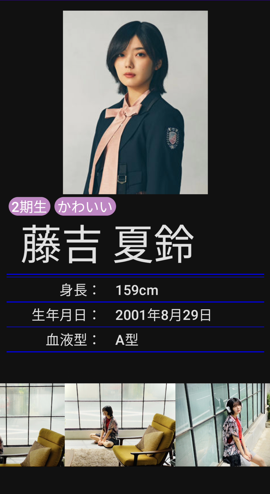

# android app

## How to get this App
------------

You can get this App here

## Sample
------------

### Views

| Projects |  |
|:-----|:---------:|
|  **Demo Video**  What you can do with this App   • Compare the three groups (乃木坂46, 櫻坂46, 日向坂46)  • Get detailed information  • Access to the member blog  • Check the formations of 日向坂46's songs   |  |  
|  |  |  
|  **Home Page Screen**  You can scroll and tap one photo to get more specific information   • Select one group • Sort and narrow down members  • Tap to go to the detailed page  **[> Code Here](app/src/main/java/io/kokoichi/sample/sakamichiapp/ui/home)** |  |  
|  **Detailed Page Screen**  You can get the detailed information of a specific member   • Tags  • Photos from the member blog  • Tap the photo to go to the blog  **[> Code Here](app/src/main/java/io/kokoichi/sample/sakamichiapp/ui/detailedPage)** |  |  
|  **Formation Page Screen**  You can get formations of 日向坂46's songs   **[> Code Here](app/src/main/java/io/kokoichi/sample/sakamichiapp/ui/formationPage)** |  |  

