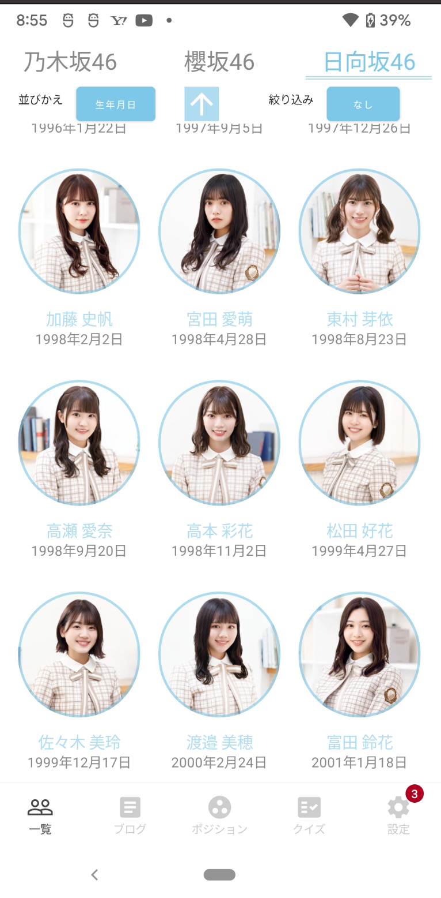
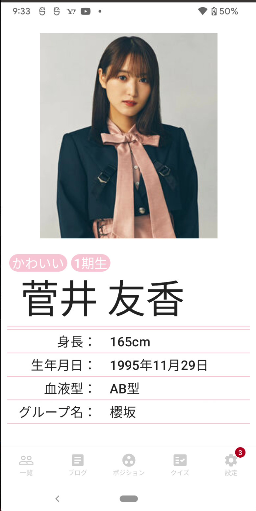
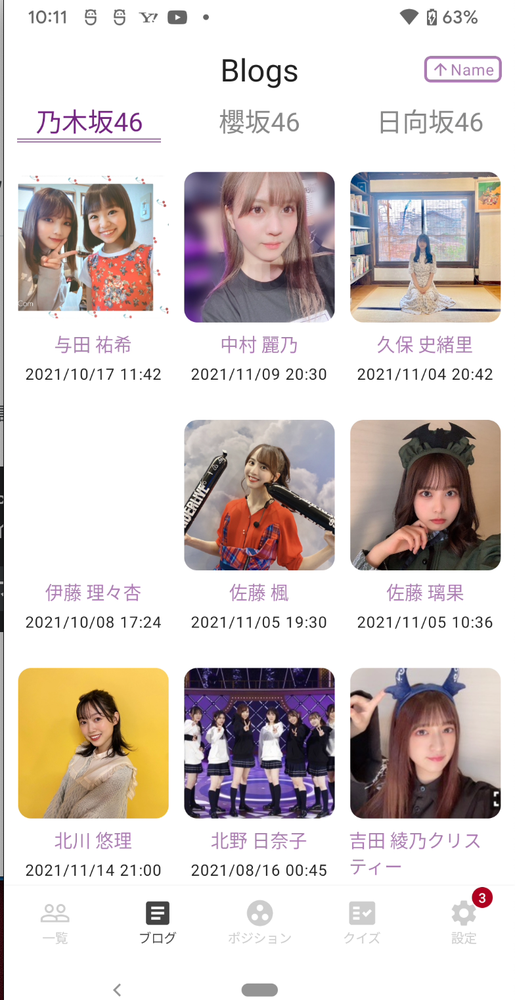
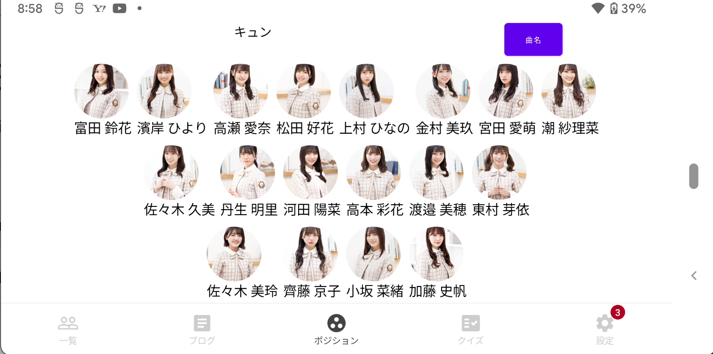
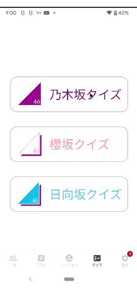

# Sakamichi app

## How to get this App
------------

* [Link](https://kokoichi0206.mydns.jp/app-debug.apk)
* QR Code

## SampleViews
------------

| Screen |  |
|:-----|:---------:|
|  **Member List Screen**  You can look at the member list.   • Compare the three groups  • Get detailed information by tapping the image  • Sort members by birthday, generation, etc.  **[> Browse](app/src/main/java/io/kokoichi/sample/sakamichiapp/presentation/member_list/)** |  |  
|  **Detailed Page Screen**  You can get the detailed information of a specific member.   • Tags  • Height  • Birthday  • Blood type  **[> Browse](app/src/main/java/io/kokoichi/sample/sakamichiapp/presentation/member_list/)** |  |  
|  **Blog Screen**  You can check the image and the updated datetime of the latest blog.   • The displayed date is updated every day at midnight • Sort by name or updated time  • Tap to go to the detailed page  **[> Browse](app/src/main/java/io/kokoichi/sample/sakamichiapp/presentation/blog/)** |  |  
|  **Position Screen**  You can get formations of 日向坂46's songs   **[> Browse](app/src/main/java/io/kokoichi/sample/sakamichiapp/presentation/positions/)** |  |  
|  **Quiz Screen**  You can take a quiz about the members.   • Four kinds of quizzes  **[> Browse](app/src/main/java/io/kokoichi/sample/sakamichiapp/presentation//)** |  |  
